# 代码仓设计与实现深度分析报告

## 0. 阅读前提与分析边界

本报告基于当前工作目录中可见的源码快照完成。当前根目录只提供了 `src/` 主体源码树，未见：

- `.git`
- `package.json` / `bunfig.toml`
- 根级测试目录
- CI 配置
- 发布脚本

因此本文所有结论都严格区分为三类：

- 已确认事实：可直接从当前源码验证
- 合理推断：由多处代码路径共同支撑的架构判断
- 未确认项：当前快照无法可靠证明的内容

本报告面向已经具备工程经验、需要快速掌握该系统设计与实现的工程师。目标不是“总结目录”，而是解释：

1. 系统实际上在做什么
2. 为什么会组织成现在这个样子
3. 主运行路径如何闭环
4. 哪些抽象是关键支点
5. 哪些区域最难修改、为什么难改
6. 新工程师如何高效率建立可维护级理解

---

## 1. 项目概览

### 1.1 这个系统是什么

#### 已确认事实

从以下核心文件可以确认，这不是单一用途 CLI，而是一套终端 AI agent 运行内核：

- `src/main.tsx`
- `src/commands.ts`
- `src/tools.ts`
- `src/QueryEngine.ts`
- `src/query.ts`
- `src/screens/REPL.tsx`

它同时包含：

- REPL/终端 UI
- slash command 体系
- 模型可调用工具体系
- 本地 shell 与文件操作
- 多 agent / teammate / remote agent
- MCP 工具、资源与认证
- 插件与 skills
- 权限审批、classifier、sandbox
- worktree / tmux / bridge / remote session
- transcript、file history、telemetry、profiling、migration

#### 合理推断

它更接近“终端智能体产品平台”而不是“给模型包一层命令行”。这意味着系统设计的主要难点不是某个算法，而是如何把以下维度稳定组合起来：

- 模型调用
- 工具调用
- 安全约束
- 多运行模式
- 终端交互
- 扩展能力接入
- 长会话状态治理

### 1.2 目标用户与运行场景

#### 已确认事实

从命令、远程、worktree、插件、MCP、skills、agent 等代码痕迹看，目标用户至少包括：

- 在终端中直接与模型协作的开发者
- 使用后台 agent / 远程 session / worktree 隔离的高级用户
- 开发插件、skills、MCP 集成的扩展作者
- 维护产品内核本身的工程团队

#### 合理推断

该代码库支持的不只是“单用户本机交互”，还包含企业/托管/远程控制/扩展生态等产品场景，因此它的复杂度天然高于普通本地 CLI。

### 1.3 技术栈

#### 已确认事实

- 语言：TypeScript / TSX
- 运行时：Bun 特征明显，大量使用 `feature('...')`
- UI：React + Ink
- 模型 API：Anthropic SDK
- 协议扩展：`@modelcontextprotocol/sdk`
- 校验：Zod
- 配置：多 source settings + schema + cache
- 状态：自定义 store + `AppState`
- 可观测性：startup profiler、query profiler、session tracing、analytics

#### 额外观察

`src/state/AppState.tsx`、`src/screens/REPL.tsx` 等文件带有 `react/compiler-runtime` 注入和内嵌 sourcemap，说明当前可见源码可能已过构建或编译变换。这不影响控制流判断，但需要在阅读风格和行数上保持谨慎。

### 1.4 高层架构一句话定义

#### 合理推断

该系统可以概括为：

> 一个以 REPL 为交互壳、以 `query()` 为执行核心、以工具/权限/任务为运行边界、以插件/MCP/skills 为扩展通路的终端智能体平台。

---

## 2. 仓库结构与分层边界

### 2.1 可见结构

当前快照中，架构事实主要来自 `src/`。按照职责可将其划分为以下层次：

| 层次 | 代表路径 | 主要职责 |
| --- | --- | --- |
| 入口与生命周期 | `src/main.tsx` `src/setup.ts` `src/entrypoints/*` | 启动、模式分流、环境准备 |
| 交互壳 | `src/screens/REPL.tsx` `src/components/*` `src/ink/*` | 终端 UI、权限对话、消息渲染 |
| 命令层 | `src/commands.ts` `src/commands/*` | 用户 slash command |
| 查询执行层 | `src/QueryEngine.ts` `src/query.ts` `src/services/api/claude.ts` | turn 循环、模型调用、恢复 |
| 工具执行层 | `src/tools.ts` `src/Tool.ts` `src/services/tools/*` | 工具定义、权限、进度、执行 |
| 任务层 | `src/Task.ts` `src/tasks/*` | shell、agent、remote agent、teammate |
| 扩展层 | `src/services/mcp/*` `src/utils/plugins/*` `src/skills/*` | MCP、插件、skills |
| 横切基础设施 | `src/utils/*` `src/state/*` `src/services/analytics/*` `src/migrations/*` | 配置、日志、遥测、状态、迁移 |

### 2.2 真正的架构边界是什么

#### 已确认事实

目录层次虽然明显，但物理隔离并不严格。几个强信号包括：

- `src/screens/REPL.tsx` 同时依赖 query、permissions、tasks、hooks、MCP、IDE、cost、compact、session restore、bridge 等多个系统。
- `src/commands.ts` 不只是命令导出，而是 skills、workflow、plugin commands 的聚合器。
- `src/tools.ts` 不只是工具导出，而是 feature gate、环境、用户类型差异下的工具总装配器。
- `src/utils/*` 作为超大横切层，几乎被所有层直接依赖。

#### 结论

这不是严格意义上的经典分层系统，更像：

- 逻辑分层清楚
- 运行时耦合较强
- 通过上下文对象和装配器维持系统整体一致性

换句话说，它是“模块化单体”，不是强约束分层架构。

### 2.3 最关键的两个粘合抽象

#### 1. `AppState`

`src/state/AppStateStore.ts` 中的 `AppState` 不只是 UI state，而是统一运行态容器，包含：

- settings
- permission context
- tasks
- mcp clients/tools/commands/resources
- plugins
- remote / bridge 状态
- notifications / elicitation
- session hooks
- file history / attribution / prompt suggestion / todos 等

这说明很多系统不是“通过事件总线松耦合”，而是通过共享运行态耦合。

#### 2. `ToolUseContext`

`src/Tool.ts` 中的 `ToolUseContext` 承载：

- commands
- tools
- mcpClients / mcpResources
- `getAppState` / `setAppState`
- abort controller
- readFileState
- notifications
- UI 注入点
- query metadata
- agentDefinitions

它不是单纯“工具参数”，而是工具层访问应用能力的主要协议。

#### 结论

如果你理解了 `AppState` 和 `ToolUseContext`，就理解了这个系统 60% 的耦合方式。

### 2.4 系统架构图

下图展示当前源码快照中最稳定的系统结构：入口层负责装配，REPL 和 `QueryEngine` 是两条不同的外壳，而 `query.ts` 是真正共享的执行内核。

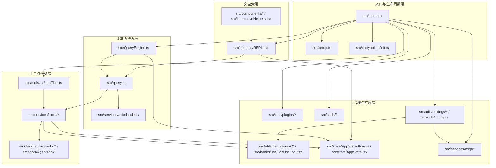

#### 图示说明

- 它展示的是“谁负责装配、谁负责执行、谁负责治理”的分层关系，而不是目录树。
- 最重要的结构性事实是：`src/query.ts` 位于中心，REPL 和 `QueryEngine` 都围绕它工作。
- 工具执行层同时接入任务、权限和状态，说明工具系统本质上是应用执行协议，而不是普通函数库。

#### 文件映射

- 入口与生命周期：`src/main.tsx`、`src/setup.ts`、`src/entrypoints/init.ts`
- 交互壳：`src/screens/REPL.tsx`、`src/components/*`
- 执行内核：`src/QueryEngine.ts`、`src/query.ts`、`src/services/api/claude.ts`
- 工具与任务：`src/tools.ts`、`src/Tool.ts`、`src/services/tools/*`、`src/Task.ts`
- 治理与扩展：`src/utils/permissions/*`、`src/state/*`、`src/services/mcp/*`、`src/utils/plugins/*`、`src/skills/*`

#### 关键观察

- 这是“模块化单体”，不是强隔离的分层服务系统。
- `main.tsx` 负责广义产品装配，而不是直接承担所有运行细节。
- `AppState` 与 `ToolUseContext` 的重要性，来自它们跨越了图中的多个层次。

---

## 3. 入口点与生命周期

### 3.1 入口是单一的，但执行入口不是单一的

#### 已确认事实

`src/main.tsx` 是进程级主入口，但系统存在两类执行入口：

1. REPL 交互路径：`src/screens/REPL.tsx` 直接调用 `query(...)`
2. SDK / headless 路径：`src/QueryEngine.ts` 包装并调用 `query(...)`

这是一个非常重要的架构事实。

#### 为什么重要

这意味着：

- `query.ts` 才是真正共享的“执行内核”
- `QueryEngine` 不是全系统唯一入口，而是 headless/SDK façade
- REPL 有自己的一层交互编排和状态准备逻辑，不会自动经过 `QueryEngine`

如果后续有人只改 `QueryEngine`，并不会自动影响 REPL 行为。

### 3.2 三段式启动链路

#### 第一段：`main.tsx`

已确认职责：

- 启动 profile checkpoint
- 预启动 MDM 读取与 keychain 预取
- 加载 commands / tools / plugins / skills / MCP
- 根据运行模式进入 REPL、remote、bridge、print 等路径

从文件顶部注释可以明确看出，作者在启动时间上有显式优化目标，而不是顺序执行所有初始化。

#### 第二段：`setup.ts`

已确认职责：

- Node 版本检查
- UDS messaging
- teammate snapshot
- terminal / iTerm 恢复
- `setCwd(cwd)`
- hook config snapshot
- file changed watcher
- worktree / tmux 相关准备

这层更偏“进入业务之前，先把终端会话环境摆平”。

#### 第三段：`entrypoints/init.ts`

已确认职责：

- 启用配置系统
- 应用安全环境变量
- 配置 CA 证书
- 初始化 graceful shutdown
- 初始化 event logging
- OAuth 信息补全
- repository / IDE 预探测
- remote managed settings / policy limits 预热
- proxy / mTLS / API preconnect
- scratchpad 初始化

这层更偏“基础设施总开关”。

### 3.3 为什么拆成三段

#### 合理推断

该拆分并不是代码风格问题，而是为了同时解决：

- 冷启动性能
- 运行前置条件复杂
- 不同模式之间的共享初始化
- 把“终端环境”与“产品基础设施”分离

如果把这些逻辑都塞回 `main.tsx`，不仅会造成更重的入口文件，也会让 cwd、trust、hook、worktree、proxy 等初始化顺序更难推理。

### 3.4 生命周期图

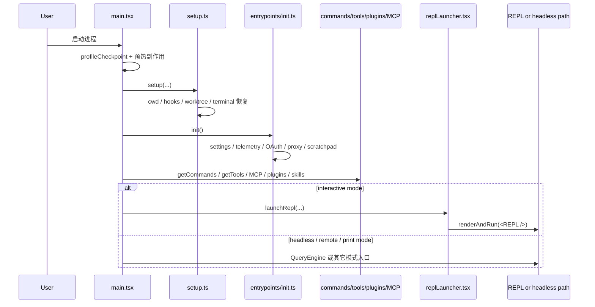

#### 图示说明

- 它展示的是启动责任如何逐层下沉，而不是所有初始化都堆在 `main.tsx`。
- `setup.ts` 处理终端与工作目录前提，`init.ts` 处理产品基础设施前提，这两个维度被有意识地拆开。
- REPL 启动并不是直接由 `main.tsx` 渲染到底，而是经由 `replLauncher.tsx` 等中介层衔接。

#### 文件映射

- 入口与模式分流：`src/main.tsx`
- 会话前提准备：`src/setup.ts`
- 基础设施启用：`src/entrypoints/init.ts`
- 交互式渲染路径：`src/replLauncher.tsx`、`src/interactiveHelpers.tsx`、`src/screens/REPL.tsx`

#### 关键观察

- 同一份源码必须同时支持 REPL、headless、remote、bridge 等路径，这就是三段式启动存在的根本原因。
- 把工作目录、hook、worktree、tmux 等前置逻辑提前，可以降低后续执行层的环境假设数量。

---

## 4. 核心架构与关键抽象

### 4.1 命令系统：用户接口聚合器

#### 关键文件

- `src/commands.ts`
- `src/commands/*`
- `src/skills/loadSkillsDir.ts`
- `src/utils/plugins/loadPluginCommands.ts`

#### 已确认事实

`src/commands.ts` 不是简单注册表，而是一个多来源装配器：

1. `COMMANDS()` 聚合内建命令
2. `getSkills(cwd)` 聚合：
   - skill dir commands
   - plugin skills
   - bundled skills
   - builtin plugin skills
3. `getWorkflowCommands(cwd)` 按 feature gate 条件加载 workflow commands
4. `loadAllCommands(cwd)` 把多来源命令合并
5. `getCommands(cwd)` 再按 availability 和 `isEnabled()` 过滤，并插入 dynamic skills

#### 深层设计意图

这说明命令在该系统中承担两种角色：

- 用户可见的操作入口
- 扩展内容装载通路

换言之，命令层不是纯 UI 层，而是“产品能力注册中心”的一部分。

#### 隐藏约束

`getCommands(cwd)` 必须每次重新跑 availability / `isEnabled()`，因为登录态、provider、feature 状态可能在 session 中改变。这意味着命令可见性不是静态的。

### 4.2 工具系统：不是函数库，而是执行协议

#### 关键文件

- `src/tools.ts`
- `src/Tool.ts`
- `src/services/tools/*`

#### 已确认事实

`src/tools.ts` 中 `getAllBaseTools()` 统一装配所有工具，并按运行环境、feature gate、用户类型动态决定最终可见工具集合。

`src/Tool.ts` 里有一个重要但容易被忽略的设计：`buildTool(...)`。

它为工具定义提供一组默认值，其中几个默认值是明显的架构信号：

- `isConcurrencySafe` 默认 `false`
- `isReadOnly` 默认 `false`
- `isDestructive` 默认 `false`
- `checkPermissions` 默认 `allow`
- `toAutoClassifierInput` 默认空字符串

#### 架构解读

这里体现了两种不同的默认策略：

1. 并发与只读判定采取保守默认值
   - 默认不并发
   - 默认不视为只读
2. 通用权限流程默认交给更高层统一判定
   - `checkPermissions` 默认 allow，不是“不做权限”，而是“由通用权限系统接管”

#### 设计取舍

这是一个典型的产品工程折中：

- 工具作者如果不声明并发安全，系统宁可慢一点也不冒险
- 权限不要求每个工具自己实现一套，避免权限逻辑碎片化

#### 结论

工具抽象的真实目标不是“让工具更容易写”，而是“让工具可被统一编排、审批、记录和渲染”。

### 4.3 查询执行层：REPL 与 SDK 共用的真实内核

#### 关键文件

- `src/query.ts`
- `src/QueryEngine.ts`
- `src/screens/REPL.tsx`
- `src/services/api/claude.ts`

#### 已确认事实

`query.ts` 才是核心执行引擎，而不是 `QueryEngine` 本身。

##### REPL 路径

在 `src/screens/REPL.tsx` 中：

- `handlePromptSubmit(...)` 负责解析用户输入、即时命令、引用、队列逻辑
- 真正进入模型循环时，REPL 构建 `toolUseContext`
- 从 store 重新获取 fresh tools / mcpClients
- 计算 system prompt / userContext / systemContext
- 然后直接：

```ts
for await (const event of query({...})) {
  onQueryEvent(event)
}
```

##### SDK / headless 路径

在 `src/QueryEngine.ts` 中：

- 先处理 `processUserInput(...)`
- 提前持久化 transcript
- 组装系统 prompt
- 再调用 `query({...})`

#### 隐藏约束 1：两条入口共享内核，但前置逻辑不同

这意味着：

- `query.ts` 的行为对 REPL 和 SDK 都生效
- `QueryEngine` 中的某些逻辑，例如 transcript 提前持久化、SDK replay、permission denial 收集，只会影响 SDK/headless
- REPL 特有的 fresh tools/MCP client 刷新逻辑不会自动出现在 SDK 路径

#### 隐藏约束 2：REPL 在 query 前重新取 tools / MCP

`src/screens/REPL.tsx` 中特意不用闭包捕获的 `tools` / `mcpClients`，而从 `getToolUseContext(...).options` 重新读取 fresh 值。这是为避免在 REPL render 与 turn 开始之间，MCP 状态被刷新后仍使用过期工具池。

这属于非常产品化、很容易在重构中被误删的隐式约束。

### 4.4 `query.ts` 的真实职责：一个 turn 级状态机

#### 已确认事实

`query()` 包装 `queryLoop()`，而真正的复杂度在 `queryLoop()` 内部。其关键阶段顺序可以明确归纳为：

1. 建立 mutable state
2. 创建 budget tracker
3. 启动 memory prefetch
4. 每轮迭代启动 skill discovery prefetch
5. `yield stream_request_start`
6. 建立 `queryTracking`（chainId/depth）
7. 基于 compact boundary 截取消息视图
8. `applyToolResultBudget(...)`
9. snip compact
10. microcompact
11. context collapse
12. autocompact
13. 调用模型 API
14. 处理 tool use / tool result / continuation / retry / stop hooks

#### 架构评价

这说明 `query.ts` 不是简单“调用 API + 跑工具”，而是一个上下文治理器。作者显然把长期会话中的上下文膨胀当成核心问题，因此在单个 turn 内串联了：

- result budget
- snip
- microcompact
- context collapse
- autocompact

这是该系统非常鲜明的工程特征。

### 4.5 `QueryEngine` 的附加职责：headless façade 与恢复保障

#### 已确认事实

`src/QueryEngine.ts` 除了调用 `query()`，还承担几个只在 headless/SDK 路径存在的重要职责：

- 包装 `canUseTool`，收集 permission denials
- 调用 `processUserInput(...)`
- 在进入 query loop 前记录 transcript
- 在 query 过程中持续记录 transcript
- 在文件历史开启时为用户输入做 snapshot
- 处理 replayable user messages

#### 关键设计理由

代码注释明确说明了一个重要原因：

> 在进入 query loop 前先写 transcript，是为了避免进程在 API 响应前被杀掉时，session 无法 resume。

这是一个很强的产品工程信号：作者已经遇到过“消息接受了但还没收到首个 API 响应就退出”的恢复问题，并专门修补。

### 4.6 工具执行层：统一执行、统一审批、统一可观测

#### 关键文件

- `src/services/tools/toolExecution.ts`
- `src/services/tools/toolOrchestration.ts`
- `src/services/tools/StreamingToolExecutor.ts`
- `src/hooks/useCanUseTool.tsx`

#### 已确认事实

工具执行流程分为两层：

##### 1. 调度层

`toolOrchestration.ts` 和 `StreamingToolExecutor.ts` 负责：

- 判断 `isConcurrencySafe()`
- 把只读/并发安全工具成批并行执行
- 把非并发安全工具串行执行
- 处理 sibling error / fallback discard / interrupt behavior

##### 2. 单工具执行层

`toolExecution.ts` 中 `runToolUse(...)` 负责：

- 在可见工具集中查找工具
- 兼容 deprecated alias
- 获取 MCP server type / base URL
- 检查 abort
- 进入权限与调用流程
- 统一错误包装成 tool_result

#### 更深一层：权限判定不是发生在 UI 组件里

`useCanUseTool.tsx` 显示，权限判定流程本质上是一个异步决策器：

1. `hasPermissionsToUseTool(...)` 给出初始行为：allow / deny / ask
2. 如果 allow，直接返回并记录 classifier / telemetry 信息
3. 如果 ask，则根据当前上下文选择不同处理器：
   - coordinator handler
   - swarm worker handler
   - interactive handler
4. 对 Bash 还可能利用 speculative classifier check 直接放行

#### 结论

权限系统不是“工具执行失败时弹个框”，而是工具调用协议内嵌的一层异步治理状态机。

### 4.7 状态与 UI：REPL 是应用壳，不只是视图

#### 已确认事实

`src/screens/REPL.tsx` 在结构上承担了过多责任，包括：

- prompt 提交
- slash command 处理
- query 调用
- tool permission context 更新
- system prompt 组装
- API metrics 采集
- background tasks / bridge / remote / ide integration
- session 恢复 / compact / file history / attribution

#### 架构判断

REPL 实际上是一个“集成壳 + 协调器 + 视图层”的复合体，不应被误认成普通展示组件。

### 4.8 插件、MCP、Skills：三条不同的扩展轴

#### 1. Skills

`src/skills/loadSkillsDir.ts` 表明 skills 是 markdown/frontmatter 驱动的 prompt command，支持：

- description / whenToUse
- allowedTools
- hooks
- paths
- model / effort
- user-invocable

#### 2. Plugin commands

`src/utils/plugins/loadPluginCommands.ts` 表明 plugin commands 同样基于 markdown，但被强制命名空间化，例如：

- `pluginName:command`
- `pluginName:namespace:command`

并且 skill 模式下会把技能目录、插件根目录、session id、user config 等变量注入 prompt 内容。

这说明插件系统不只是“加载可执行 JS”，而是一个内容装配与变量替换平台。

#### 3. MCP

`src/services/mcp/config.ts` 中 `getAllMcpConfigs()` 明确体现了 precedence 策略：

- 若存在 enterprise MCP config，则直接使用企业控制结果
- 否则并行拉取 claude.ai connectors 与 ClaudeCode 本地 MCP config
- 对 claude.ai connectors 做 policy filter
- 用 signature dedup，避免启用的手工 server 被 claude.ai connector 重复
- 合并时 claude.ai 作为低优先级，手工配置优先

#### 结论

插件、skills、MCP 不是同义扩展点，而是三条不同扩展轴：

- Skills：流程/知识复用
- Plugins：分发与命令打包
- MCP：外部能力协议接入

### 4.9 模块/组件依赖图

下图不是传统“包依赖图”，而是把最重要的装配器、执行器和扩展入口串起来，帮助判断修改一个模块时最可能牵动哪里。

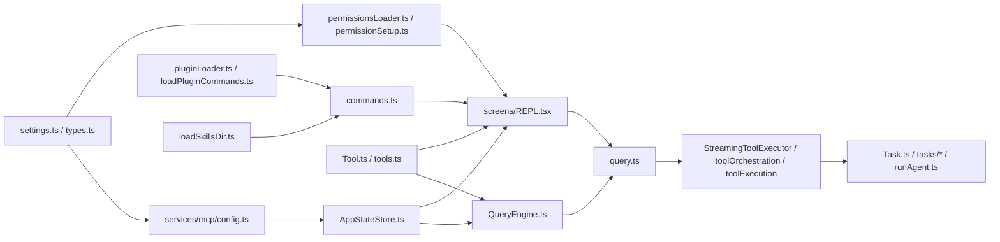

#### 图示说明

- 这张图强调“装配依赖”和“运行依赖”的交汇点，而不是把所有 imports 全量展开。
- `commands.ts` 与 `tools.ts` 并不对称：commands 更偏用户入口聚合，tools 更偏模型能力协议。
- `AppStateStore.ts` 是多个系统会汇合的运行态总线，虽然它不是 event bus，但扮演了类似作用。

#### 文件映射

- 配置与权限：`src/utils/settings/*`、`src/utils/permissions/*`
- 命令扩展：`src/utils/plugins/*`、`src/skills/loadSkillsDir.ts`、`src/commands.ts`
- 工具与执行：`src/Tool.ts`、`src/tools.ts`、`src/services/tools/*`
- 运行态与执行内核：`src/state/AppStateStore.ts`、`src/screens/REPL.tsx`、`src/QueryEngine.ts`、`src/query.ts`

#### 关键观察

- 插件和 skills 主要喂给命令层，而 MCP 和 settings 更深地影响运行态与工具可见性。
- REPL 和 `QueryEngine` 虽然都是 `query()` 的入口，但它们依赖的上游装配对象并不相同。

---

## 5. 关键执行流

本节追踪最关键的 6 条端到端流，并尽量绑定真实函数与调用点。

### 5.1 流一：交互式用户输入到 query loop

#### 主链路

1. `src/screens/REPL.tsx` 中用户触发提交
2. `src/utils/handlePromptSubmit.ts`：
   - 处理 queuedCommands 快路径
   - 解析 pasted references
   - 识别 `/exit` 等特殊输入
   - 识别即时 local-jsx command
   - 决定是排队还是直接执行
3. 回到 REPL：
   - 更新 slash-command-scoped allowedTools
   - 构建 `toolUseContext`
   - 从 fresh state 取 tools / mcpClients
   - 计算 `defaultSystemPrompt`、`userContext`、`systemContext`
   - 调用 `buildEffectiveSystemPrompt(...)`
4. 直接执行：

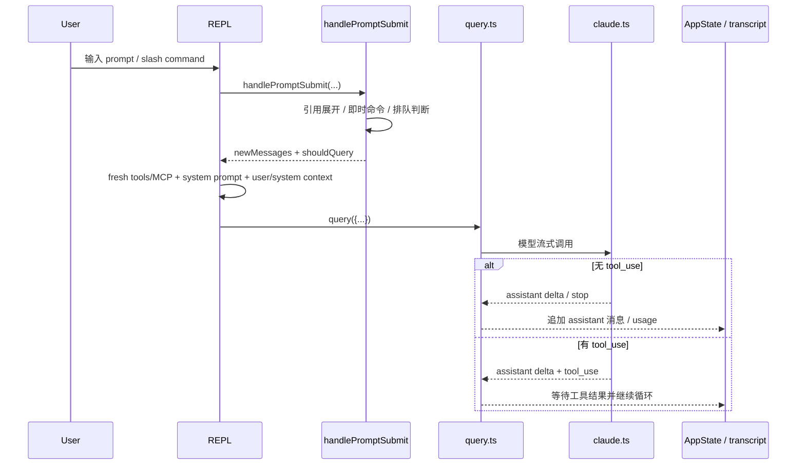

#### 关键结论

- REPL 路径并不经过 `QueryEngine`
- prompt 提交层和执行层是分开的
- `handlePromptSubmit` 还承担了局部命令解释器和输入预处理器的职责

#### 图示说明

- 它展示的是交互式路径如何从 UI 层进入共享内核，而不是只展示一次 API 调用。
- `handlePromptSubmit` 位于 REPL 和 `query()` 之间，因此它实际上承担了输入预处理和局部命令解释职责。

#### 文件映射

- 交互壳：`src/screens/REPL.tsx`
- 提交预处理：`src/utils/handlePromptSubmit.ts`
- 执行内核：`src/query.ts`
- API 适配：`src/services/api/claude.ts`

### 5.2 流二：SDK/headless 输入到 query loop

#### 主链路

1. `QueryEngine.submitMessage(...)`
2. 组装 `ProcessUserInputContext`
3. 执行 `processUserInput(...)`
4. 把用户消息先写 transcript
5. 更新 `toolPermissionContext.alwaysAllowRules.command`
6. 再调用 `query({...})`

#### 关键结论

- SDK/headless 更关注 transcript 可恢复性和 replay 语义
- `QueryEngine` 不是冗余层，而是 headless 适配层

### 5.3 流三：query loop 内部状态机

#### 实际阶段顺序

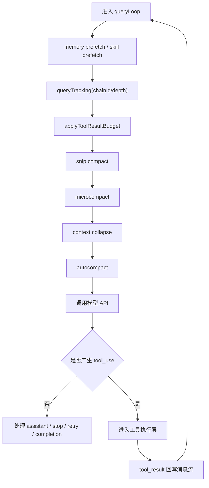

#### 隐藏约束

- `queryTracking.chainId/depth` 会随着递归 query 增长，用于 analytics 追踪
- compact 系列操作有顺序依赖，不是任意可重排
- `params.taskBudget` 在 compact 之后要重新调整 remaining

#### 设计理由

作者显然把“长上下文会话的持续运行”视为一等公民，因此 query loop 的复杂度很大一部分不是来自模型 API，而是来自上下文治理。

### 5.4 流四：tool use 到 tool result

#### 主链路

1. `query.ts` 识别 tool use
2. 进入 `StreamingToolExecutor` 或 `runTools(...)`
3. 调度层根据 `isConcurrencySafe()` 分批
4. `runToolUse(...)`
5. `streamedCheckPermissionsAndCallTool(...)`
6. `useCanUseTool(...)` 触发权限决策
7. 执行工具，生成 progress / attachment / result / error
8. 写回消息流

#### 关键副作用

- 文件系统修改
- shell task 启动
- permission prompt
- telemetry / tracing
- persisted tool result / task output

#### 设计取舍

工具层的复杂度高，但换来的能力是：

- 可中断
- 可审批
- 可并发治理
- 可流式显示进度
- 可统一渲染结果

#### 关键交互时序图

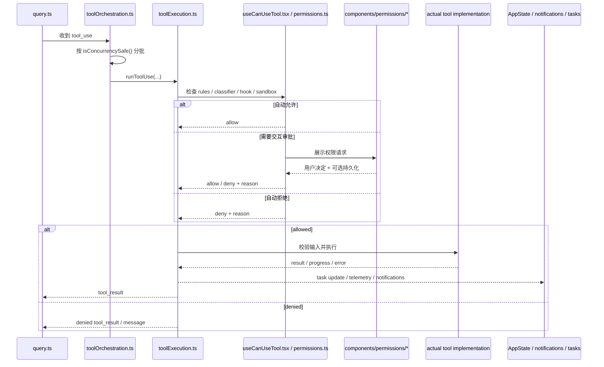

#### 图示说明

- 这张图强调 tool use 不是“模型调用本地函数”，而是穿过调度、权限、UI、状态和结果封装的一条执行协议。
- 权限交互既可能是自动决策，也可能落到 UI，所以工具执行天然是异步的。

#### 文件映射

- 调度：`src/services/tools/toolOrchestration.ts`
- 执行：`src/services/tools/toolExecution.ts`
- 权限：`src/hooks/useCanUseTool.tsx`、`src/utils/permissions/*`
- UI：`src/components/permissions/*`
- 任务与状态：`src/Task.ts`、`src/state/AppStateStore.ts`

### 5.5 流五：权限决策到 UI / 规则持久化

#### 主链路

1. settings source 中的 permission rules 通过 `permissionsLoader.ts` 装载
2. `permissionSetup.ts` 生成 `ToolPermissionContext`
3. `hasPermissionsToUseTool(...)` 进行首轮规则判定
4. 若 ask，则 `useCanUseTool.tsx` 根据场景进入：
   - coordinator handler
   - swarm worker handler
   - interactive handler
5. 用户批准后，可能更新 context，也可能写回 settings

#### 关键结论

权限不是 REPL 层的附属能力，而是贯穿 settings、运行态、工具执行和 UI 的跨层机制。

### 5.6 流六：插件 / MCP / skill 进入命令和工具池

#### 主链路

1. settings / managed settings 提供配置源
2. plugin loader / plugin command loader 解析插件内容
3. MCP config 合并本地与 claude.ai 配置
4. MCP client 建立连接并发现 tools / resources / prompts
5. skills loader 从文件系统生成 prompt commands
6. `commands.ts`、`tools.ts` 把这些能力暴露给用户或模型

#### 核心判断

这是一个“能力装配流水线”，不是单一 registry。

### 5.7 数据流图：一次 turn 中哪些数据在流动

下图聚焦“数据对象如何流动”，而不是调用顺序。它更适合回答“改这个字段会影响哪些层”这类问题。

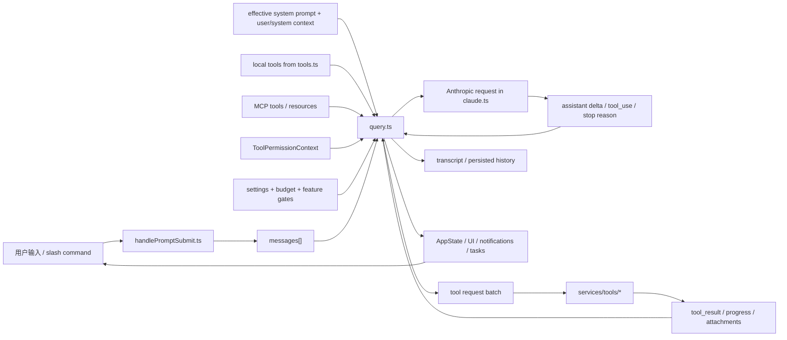

#### 图示说明

- 这张图把“消息流”“配置流”“权限上下文”“工具结果流”和“持久化/状态回写”放到同一视图里。
- 它解释了为什么 `query.ts` 的复杂度高：因为它不是只消费 `messages[]`，而是在协调多种输入数据流。

#### 文件映射

- 输入预处理：`src/utils/handlePromptSubmit.ts`
- 执行内核：`src/query.ts`
- API 适配：`src/services/api/claude.ts`
- 工具执行：`src/services/tools/*`
- 运行态与持久化：`src/state/*`、`src/QueryEngine.ts` 中的 transcript 相关逻辑

#### 关键观察

- `QueryEngine` 之所以要在进入 query loop 前写 transcript，是因为 transcript 是独立于模型返回的持久化数据流。
- 工具结果不仅回到模型，还会回到任务、通知和 UI，因此其副作用面远大于一次普通函数返回值。

---

## 6. 配置与环境模型

### 6.1 配置系统是产品治理层，不只是 JSON 读取器

#### 已确认事实

`src/utils/settings/settings.ts` 与 `src/utils/settings/types.ts` 共同实现了：

- 多 source settings
- managed settings base + drop-in
- 缓存解析
- schema 校验
- permission rule 预过滤

#### 一个值得注意的设计细节

`parseSettingsFile(...)` 在 schema validation 前先过滤 invalid permission rules，避免一个坏规则导致整个 settings 文件失效。这体现出“配置系统优先保留其余可用配置”的产品容错策略。

### 6.2 环境差异主要通过三种机制体现

#### 1. `feature('...')`

控制产品形态裁剪。

#### 2. settings source

控制用户/项目/托管策略优先级。

#### 3. 运行时上下文

例如：

- current cwd
- project root
- trust 状态
- login / OAuth 状态
- remote / worktree / bare mode

#### 结论

这个系统的“环境”不是单一环境变量表，而是 feature、settings source、会话上下文共同定义的。

### 6.3 MCP 配置的隐藏优先级

`getAllMcpConfigs()` 暴露了非常重要的产品策略：

- enterprise MCP 配置存在时，企业控制优先，屏蔽 claude.ai connector 自动接入
- 非 enterprise 模式下，claude.ai connectors 是低优先级补充，而不是主配置源
- 手工启用的 server 可以通过 signature 去重压制 claude.ai 重复 connector

这说明 MCP 不是简单“读取几份配置然后合并”，而是带有明确产品优先级设计。

---

## 7. 构建、测试与质量机制

### 7.1 当前可确认的工程机制

#### 已确认事实

- Bun feature gate 广泛使用
- React Compiler 产物痕迹明显
- 代码中存在大量 Biome / ESLint 风格规则注释
- 可观测性投入显著：
  - startup profiler
  - query profiler
  - session tracing
  - analytics logging
- 迁移机制存在：
  - `src/migrations/*`
- cleanup / graceful shutdown / transcript / file history 等长期运行态治理逻辑存在

### 7.2 当前无法确认的部分

#### 未确认项

- 完整构建命令
- 完整测试目录与框架
- CI 配置
- 发布与打包流程

### 7.3 对质量策略的合理判断

#### 合理推断

从当前可见快照看，这个项目的质量控制重心更偏向：

- 运行时保护
- 诊断与遥测
- 配置/权限/schema 校验
- 历史兼容迁移

而不是“在快照中清晰可见的大量测试”。

这并不一定代表测试不足，但在当前材料下，这是最稳妥的判断。

---

## 8. 设计评估

### 8.1 架构优势

#### 1. 执行内核与产品外壳虽耦合，但主引擎清晰

`query.ts` 作为共享执行内核非常明确，REPL 与 SDK/headless 都围绕它构建。相比把逻辑散落在多个入口中，这是一种更稳健的核心收敛方式。

#### 2. 扩展机制有明确分工

插件、MCP、skills 三者不混杂，说明作者对扩展类型有清晰分类意识。

#### 3. 权限系统设计成熟

能区分 rule、hook、classifier、mode、permission prompt tool 等不同决策来源，体现出产品级安全治理思路。

#### 4. 对长会话与恢复有工程化投入

compact、transcript 提前落盘、file history、cleanup registry、resume 相关设计说明系统不是围绕短暂交互写成的。

### 8.2 主要弱点

#### 1. 顶层装配点过于中心化

复杂度过高的文件包括：

- `src/main.tsx`
- `src/commands.ts`
- `src/tools.ts`
- `src/screens/REPL.tsx`

这些文件既是理解入口，也是重构风险中心。

#### 2. `AppState` 与 `ToolUseContext` 过重

它们让模块协作很方便，但也带来：

- 局部推理困难
- 测试隔离困难
- 字段膨胀
- 跨层副作用不易追踪

#### 3. feature gate 膨胀风险高

产品能力共存的好处是复用，代价是：

- 行为矩阵爆炸
- 某些组合路径覆盖不足
- 阅读和调试成本高

#### 4. UI 壳承担太多 orchestration

REPL 层不是“薄 UI”，而是“应用壳 + 主流程协调器”。这会使 UI 修改和运行时修改相互牵连。

### 8.3 最难安全修改的区域

#### `src/query.ts`

原因：

- compact、budget、tool use、retry、stop hooks 全在这里汇合

#### `src/services/tools/toolExecution.ts`

原因：

- 工具执行、权限、hooks、telemetry、error wrapping 汇合

#### `src/screens/REPL.tsx`

原因：

- 交互、状态、query、remote、bridge、task 全部汇合

#### `src/utils/permissions/*`

原因：

- 跨 settings、classifier、hook、UI prompt、session context

### 8.4 主要技术债

最大的技术债不是某个函数写得不好，而是“产品能力叠加导致的组合复杂度”。

具体表现为：

- 命令来源越来越多
- 工具类型越来越多
- 权限路径越来越多
- 运行模式越来越多
- 扩展接入面越来越多

这类技术债不容易通过局部重构一次性清掉，需要靠：

- 更清晰的能力边界
- 更强的行为矩阵测试
- 更少的顶层装配文件
- 更稳定的上下文契约

---

## 9. ClaudeCode 的项目理解、上下文构建与记忆机制

本节不讨论“通用 AI coding tool 应该怎么做”，而是只分析当前仓库中可见的实现。结论先行：

- ClaudeCode 没有把“项目理解”实现成一个单独的知识图谱或向量检索服务。
- 它采用的是多层拼接方案：文件/仓库发现、指令文件注入、动态搜索工具、会话 transcript、持久记忆目录、session memory、以及 query 级上下文压缩共同构成“理解能力”。
- 这使它非常贴近真实工作流，但也意味着项目理解更偏运行时行为，而不是预计算的仓库模型。

### 9.1 项目理解：仓库结构如何被分析、表示与利用

#### 已确认事实

当前仓库中，与“项目理解”最直接相关的实现并不是单个模块，而是几个层次的组合：

1. 仓库与 Git 身份识别：
   - `src/utils/detectRepository.ts`
   - `src/context.ts` 中的 `getGitStatus()`
2. 指令文件与项目级约束发现：
   - `src/utils/claudemd.ts`
   - `src/context.ts` 中的 `getUserContext()`
3. 文件级检索和定位：
   - `src/tools/GrepTool/GrepTool.ts`
   - `src/components/GlobalSearchDialog.tsx`
   - `src/native-ts/file-index/index.ts`
   - `src/tools/FileReadTool/FileReadTool.ts`
4. 会话与历史级检索：
   - `src/utils/transcriptSearch.ts`
   - `src/utils/agenticSessionSearch.ts`
   - `src/utils/sessionStorage.ts`

#### 工程解释

ClaudeCode 的“项目理解”不是先离线构建一份仓库模型，再在每个任务里查询那份模型；它更像一个层层递进的运行时理解栈：

- 第一层是轻量仓库元数据：Git branch、remote、status、recent commits，这些通过 `context.ts` 进入 system context。
- 第二层是显式规则和约束：`CLAUDE.md`、`.claude/rules/*.md`、managed settings、memory 入口文件等被扫描并注入 user context。
- 第三层才是按任务动态读取代码：通过 Grep/Read/Glob、全局搜索、MCP/LSP 等工具去定位相关代码。

也就是说，它并不试图“预先完全理解整个 repo”，而是维持一个最小的稳定底座，再按任务逐步扩展上下文。

#### 相关代码证据

- `src/context.ts` 的 `getSystemContext()` 会抓取一次 Git 状态快照，并明确标注这是“conversation start snapshot”，不会在会话中持续更新。
- `src/context.ts` 的 `getUserContext()` 会加载 `CLAUDE.md` / `.claude/rules` / memory files，并缓存结果供后续 prompt 复用。
- `src/components/GlobalSearchDialog.tsx` 采用 `ripGrepStream` 做全文检索，说明仓库定位主要依赖外部搜索能力，而不是内部语义图。
- `src/native-ts/file-index/index.ts` 提供的是高性能 fuzzy file searching，索引来源仍然是 file list，而不是 AST、symbol graph 或 embeddings。

#### 架构判断

ClaudeCode 的项目理解是“工具驱动 + 指令驱动 + 会话驱动”的，而不是“预计算知识库驱动”的。

这带来的好处是：

- 不需要昂贵的离线索引构建
- 对任意仓库都能快速工作
- 与真实终端工作流一致

代价是：

- 对深层跨模块关系的理解，更依赖当前任务过程中的多次搜索与读取
- 没有一个统一、可查询的 repository graph 作为长期支撑

### 9.2 上下文构建：模型交互前到底拼了什么

#### 已确认事实

上下文构建至少分为三类输入：

1. 稳定前缀：
   - `systemPrompt`
   - `userContext`
   - `systemContext`
   由 `src/utils/queryContext.ts` 和 `src/context.ts` 组装
2. 会话消息：
   - `messages`
   - transcript 恢复内容
   - attachment / tool_result / compact boundary
3. 能力描述：
   - tools schema
   - MCP tools/resources
   - skills / commands

`src/utils/queryContext.ts` 的 `fetchSystemPromptParts()` 明确把 system prompt 前缀拆成三块：默认 system prompt、user context、system context。`QueryEngine` 和 side-question/forked flows 共享这套前缀构造逻辑，以尽量保持 prompt cache 命中。

#### 范围控制机制

当前可见代码里，至少有五种上下文范围控制手段：

1. 输入前缀缓存：
   - `src/utils/forkedAgent.ts` 的 `CacheSafeParams`
   - `saveCacheSafeParams()` / `getLastCacheSafeParams()`
2. 工具定义裁剪或延迟：
   - `src/utils/toolSearch.ts`
   - 对 deferable tools 使用 `defer_loading`
3. 会话消息压缩：
   - `src/query.ts`
   - `src/services/compact/*`
4. 读取去重与复用：
   - `src/tools/FileReadTool/FileReadTool.ts`
   - `readFileState`
   - `src/utils/fileReadCache.ts`
5. 指令文件注入过滤：
   - `src/utils/claudemd.ts` 的 `filterInjectedMemoryFiles()`

#### 工程解释

ClaudeCode 的 context construction 不是“一次选一批文件塞给模型”，而是一个动态预算管理系统：

- prompt 前缀尽量稳定，以提高缓存复用率
- 大而可延迟的 tool schema 被 Tool Search 延后
- 重复读取的文件内容通过 read cache 和 dedup 减少重复注入
- 会话历史通过 microcompact、autocompact、reactive compact、session-memory compact 逐步压缩

这也是为什么 `query.ts` 会成为最复杂的模块之一：它既要驱动模型，又要维护上下文预算。

### 9.3 记忆机制：有哪些持久或半持久结构

#### 已确认事实

当前仓库中至少存在四类“记忆/持久上下文”：

1. 持久 memory 目录：
   - `src/memdir/*`
   - auto memory / team memory / reference memory / feedback memory / project memory
2. session memory：
   - `src/services/SessionMemory/*`
   - 周期性维护单个 markdown 文件，记录当前会话摘要
3. transcript / session storage：
   - `src/utils/sessionStorage.ts`
   - JSONL transcript、resume、sidechain transcript
4. agent memory：
   - `src/tools/AgentTool/agentMemory.ts`
   - `src/tools/AgentTool/agentMemorySnapshot.ts`

#### 一个非常关键的设计原则

`src/memdir/memoryTypes.ts` 明确写出：代码模式、文件结构、调试修复方案这类“可从当前项目重新推导”的信息不应被存入 memory。也就是说，ClaudeCode 有意识地区分：

- 可重新推导的 repo state
- 需要长期保留的 user/project memory

这是一个非常成熟的设计取舍，因为它避免把 memory 变成代码副本。

#### retrieval 机制是什么

当前没有看到 embeddings 或 vector database 的证据。相反，记忆检索主要依赖：

- 目录扫描：`src/memdir/memoryScan.ts`
- frontmatter manifest：按文件名、描述、mtime 构造候选清单
- sideQuery 选择器：`src/memdir/findRelevantMemories.ts`

也就是说，记忆检索是“scan + LLM rerank”，而不是“embedding nearest-neighbor search”。

#### session memory 与 long-running task

`src/services/SessionMemory/sessionMemory.ts` 显示 session memory 是通过 post-sampling hook 周期性触发的：

- 只在 `repl_main_thread` 上运行
- 必须达到 token 和 tool-call 阈值
- 用 `runForkedAgent()` 在后台更新 markdown
- 与 autocompact 协同工作

这说明 ClaudeCode 不只是依赖 transcript 长度本身来维持多步任务，而是会主动生成“可压缩的中间记忆层”。

#### 额外的半持久结构

- `src/services/AgentSummary/agentSummary.ts` 每 30s fork 一次子 agent transcript，生成简短进度摘要，用于 coordinator UI。
- `src/utils/agenticSessionSearch.ts` 可以在 session 历史中做语义检索，但它依赖的是 transcript excerpt + sideQuery，而不是向量索引。
- `src/utils/transcriptSearch.ts` 为 UI 搜索构造可搜索文本，并用 `WeakMap` 做会话内缓存。

### 9.4 交互模型：用户输入如何变成可行动上下文

#### 已确认事实

交互连续性主要由以下几层实现：

1. 输入预处理：
   - `src/utils/handlePromptSubmit.ts`
2. REPL 运行壳：
   - `src/screens/REPL.tsx`
3. headless 会话外壳：
   - `src/QueryEngine.ts`
4. transcript 持久化与恢复：
   - `src/utils/sessionStorage.ts`
   - `src/utils/sessionRestore.ts`
5. forked agent / sidechain：
   - `src/utils/forkedAgent.ts`

#### 工程解释

ClaudeCode 维持连续性的关键不是“把所有历史都塞进下一轮 prompt”，而是：

- transcript 持久化，保证会话可恢复
- compact boundary，允许旧上下文被裁剪但保留摘要边界
- session memory，给长会话提供稳定摘要
- forkedAgent 的 `CacheSafeParams`，让后台任务和前台主线程共享相同的 cache-critical prefix

这意味着它的 continuity 既来自消息历史，也来自一组辅助状态层。

#### 对多步任务的支持方式

- transcript：保留完整事件历史
- task system：保留执行状态
- session memory：保留压缩后的“当前状态”
- agent summary：保留并行子 agent 的近期状态
- resume / restore：在重启后恢复 fileHistory、attribution、todos、context collapse state

换句话说，ClaudeCode 对“多步任务”的支持是分层实现的，而不是靠单一内存对象。

### 9.5 局限、风险与 trade-offs

#### 已确认事实

当前代码能明确支持以下判断：

- 没有发现通用 embeddings / vector index / code graph 数据库
- 文件索引 `src/native-ts/file-index/index.ts` 是 fuzzy filename index，不是语义 repo graph
- transcript 和 memory retrieval 都偏运行时扫描 + rerank

#### 工程层面的 trade-offs

1. 优势
   - 几乎不依赖离线预处理
   - 对任意仓库启动成本低
   - 能和终端工具天然对齐

2. 风险
   - 深层跨模块关系需要反复搜索和读取，效率受任务策略影响
   - memory freshness 依赖验证；`memoryTypes.ts` 甚至明确要求 recall 后再验证
   - feature gate、tool deferral、compact 路径叠加后，context 行为较难全局推理

3. 缺失能力
   - 没看到统一的 repository knowledge graph
   - 没看到跨会话的代码级 embedding retrieval
   - 没看到“任务相关文件集合”的稳定索引层，更多依赖临场搜索和模型判断

#### 结论

ClaudeCode 的项目理解能力，本质上是一套“运行时上下文工程”：

- 用指令文件和 Git 快照提供最小稳定前缀
- 用搜索、读取、工具、session 历史和记忆目录按需补充上下文
- 用 compact / session memory / transcript / summaries 维持长期连续性

这是一种非常工程化、现实主义的实现路径。它比“先做全量知识库再回答问题”更轻、更通用，但也更依赖运行时策略的质量与模型自身的探索能力。

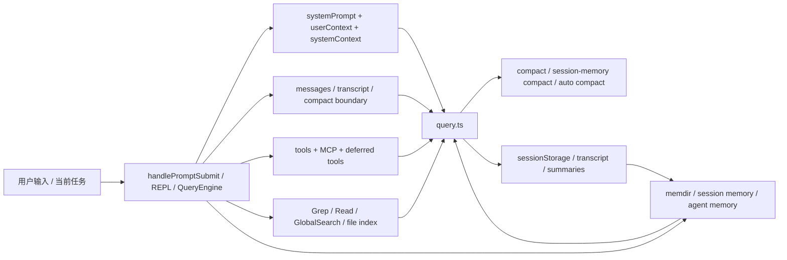

#### 图示说明

- 这张图展示 ClaudeCode 的“理解能力”并不是独立模块，而是 query 前后多个系统共同实现的。
- `SEARCH` 与 `MEMORY` 都是 query 的输入来源，但二者代表不同哲学：前者处理可重新推导的 repo state，后者处理不可重新推导的长期信息。

#### 文件映射

- 上下文前缀：`src/context.ts`、`src/utils/queryContext.ts`
- 动态检索：`src/tools/GrepTool/GrepTool.ts`、`src/components/GlobalSearchDialog.tsx`、`src/native-ts/file-index/index.ts`
- 记忆：`src/memdir/*`、`src/services/SessionMemory/*`、`src/tools/AgentTool/agentMemory.ts`
- 持久化与连续性：`src/utils/sessionStorage.ts`、`src/utils/sessionRestore.ts`、`src/utils/forkedAgent.ts`

---

## 10. 模型交互前预处理、工具体系、Memory 与 Dream 深潜

这一节不是再做一遍“模块导览”，而是把交互架构拆开看它的内部工程机制。重点不是“有这些模块”，而是：

- 一次输入在进入主模型前到底经历了哪些确定性改写、筛选和上下文拼装。
- 工具调用为什么不是普通函数调用，而是一套带权限、hook、上下文回写和并发语义的协议。
- ClaudeCode 如何在不引入向量库的情况下维持长期连续性，并把 memory 拆成多个职责层。
- `Dream` 为什么是后台 memory consolidation，而不是主对话里的推理模式。

这一节的主要证据来自 `src/utils/handlePromptSubmit.ts`、`src/utils/processUserInput/*`、`src/utils/queryContext.ts`、`src/context.ts`、`src/query.ts`、`src/Tool.ts`、`src/tools.ts`、`src/services/tools/*`、`src/services/SessionMemory/*`、`src/memdir/*`、`src/services/autoDream/*`。

先给出总判断：

- 已确认事实：ClaudeCode 没有独立 planner service。规划、工具选择、继续追问和继续执行主要发生在 `query()` 主循环内部，运行时只负责把这个循环约束在权限、token、cache 和持续性边界内。
- 已确认事实：所谓“交互前预处理”实际分成两层。第一层发生在输入进入 turn 时，负责规范化和分流。第二层发生在 `query()` 即将调用模型前，负责裁剪、折叠、压缩和补前缀。
- 已确认事实：memory 不是单一存储，而是 `memdir + session memory + transcript + agent memory + execution caches` 的分层系统，每层负责不同时间尺度和不同可信度的连续性。
- 合理推断：团队的设计目标不是构建一个“自动理解整个仓库的离线知识图谱”，而是构建一个在终端工作流中持续装配上下文、持续治理窗口、持续维护记忆的运行时系统。

### 10.1 模型交互前预处理机制

#### 10.1.1 机制目标

这一层的目标不是“美化输入”，而是把高噪声、强交互、容易失控的原始终端输入，转换成主循环可处理的结构化 turn。它同时承担四项职责：

- 输入控制：决定这次输入是立即执行、进入队列、还是打断当前 turn。
- 内容标准化：把文本、粘贴文本、粘贴图片、content blocks、远程输入统一成内部消息形态。
- prompt 路由：把 bash、slash command、普通 prompt 送到不同执行路径，而不是让模型自行识别。
- 上下文前置：在进入主模型前把 attachments、memory、规则文件、IDE selection、meta 信息注入进消息流。

从架构意图看，这一层是在尽量前移“确定性工作”。凡是代码能可靠完成的改写，都不希望交给模型在自然语言层自行推断。

#### 10.1.2 设计结构

可见代码把预处理拆成四个串联阶段：

1. `handlePromptSubmit()` 负责输入入口、队列和打断语义。
2. `executeUserInput()` 负责一个 turn 内多条 queued command 的批处理和生命周期控制。
3. `processUserInput()` / `processUserInputBase()` 负责把输入编译成消息。
4. `query()` 负责 query-time packing，也就是最后一次进入模型前的窗口治理。

这四层不是重复关系，而是不同抽象层：

- `handlePromptSubmit()` 偏 control-plane，解决“何时执行、是否排队”。
- `processUserInputBase()` 偏 compile step，解决“这段输入被翻译成什么消息和附件”。
- `processTextPrompt()` / `processSlashCommand()` / `processBashCommand()` 偏 route-specific lowering，解决“不同语义输入如何进入不同运行子系统”。
- `query()` 偏 runtime budget manager，解决“当前上下文怎样才适合发给模型”。

#### 10.1.3 核心实现路径

普通 REPL 文本输入的主链路可以按代码层次写成：

1. `handlePromptSubmit()` 先用 `parseReferences()` 识别 `[Pasted text #N]` / `[Image #N]` 引用。
2. 它通过 `expandPastedTextRefs()` 把引用展开成真实文本，同时过滤“占位符已经删掉但 pastedContents 还残留”的孤儿图片。
3. 它把 `exit`、`quit`、`:q` 等词重写成 `/exit`，并优先检查 local-jsx immediate command。
4. 如果 `queryGuard.isActive` 或存在外部 loading，它调用 `enqueue()` 将输入排队，而不是并发开启第二个 turn。
5. `executeUserInput()` 为整个 turn 创建新的 `AbortController`，并通过 `queryGuard.reserve()` 把这一轮标记为正在运行。
6. 它逐个处理 queued commands。只有第一条命令会带 attachments、IDE selection 和 pastedContents，后续命令显式 `skipAttachments`，避免上下文重复膨胀。
7. `processUserInput()` 会先调用 `processUserInputBase()`，得到 `messages + shouldQuery`，再在 `shouldQuery === true` 时执行 `executeUserPromptSubmitHooks()`。
8. 如果 hook 返回 `blockingError`，原始用户 prompt 不再进入主模型，而是替换成一个 warning system message。
9. 如果 hook 要求 `preventContinuation`，则保留原始 prompt，但停止进入 query。
10. 若继续进入 query，`onQuery()` 再把这些新消息交给 `query()`。

这条链路有一个很强的实现特征：用户输入在进入 `query()` 前已经不再是简单字符串，而是一组可能包含 `user`、`attachment`、`system`、`progress`、`isMeta user` 的混合消息。

#### 10.1.4 输入归一化与路由细节

`processUserInputBase()` 是预处理最关键的“编译器前端”。

它对数组输入和字符串输入走了不同路径：

- 若输入是 `ContentBlockParam[]`，会逐个 image block 调用 `maybeResizeAndDownsampleImageBlock()`，并尽量抽取尺寸信息，为后续追加 image metadata。
- 若输入包含粘贴图片，则先 `storeImages()` 落盘，再并行 resize base64 图片，最后把“尺寸 + 路径”写成 `isMeta` 文本消息。这样模型和工具都能看到稳定文件路径，而不是只看到瞬时 base64。
- 若输入来自 remote/bridge，且设置了 `skipSlashCommands`，则只有 `isBridgeSafeCommand()` 判定安全的 slash command 才会被作为本地命令执行。其它 `/foo` 会退化成普通文本，防止远端客户端意外触发本地终端专属命令。
- 若命中 `ULTRAPLAN` 关键字，`processUserInputBase()` 会在 attachment extraction 之前直接把输入改写成 `/ultraplan ...`，并调用 `processSlashCommand()`。这是显式 prompt routing，不是让模型从自然语言里“猜出现在该进入 ultraplan 模式”。

三条路由路径的行为差异也非常具体：

- `processBashCommand()` 不走主模型，直接调用 `BashTool` 或 PowerShell，对结果做 `processToolResultBlock()` 后返回 `shouldQuery: false`。这说明 bash mode 是本地工具短路，不经过 Claude 推理。
- `processSlashCommand()` 会先解析命令名，再根据 command type 分到 `local-jsx`、`local`、`prompt` 三类。`context: 'fork'` 的 prompt command 会走 `executeForkedSlashCommand()`，也就是直接生成一个 subagent。
- `processTextPrompt()` 则生成普通 `UserMessage`，并附上 `attachmentMessages`、图片 blocks、promptId、permissionMode、`isMeta` 等辅助字段。

#### 10.1.5 prompt 前缀与 query-time packing

进入 `query()` 之前还有第二层预处理，这一层不是处理输入，而是处理上下文窗口。

`fetchSystemPromptParts()` 会构造三个 cache-critical 前缀片段：

- `defaultSystemPrompt`
- `userContext`
- `systemContext`

它的实现有一个重要约束：如果设置了 `customSystemPrompt`，则默认 system prompt 和 `getSystemContext()` 会一起跳过，因为该路径意味着调用者要完全替换默认 prompt，而不是在默认 prompt 上附加覆盖。

`context.ts` 中的两个上下文构造函数则负责提供稳定前缀：

- `getSystemContext()` 主要注入 git status 快照、当前分支、默认分支、最近 commits，以及可选 cache breaker。它通过 `memoize()` 保证整个会话期只读一次，明确把 git 状态当成“会话起点快照”，而不是随 turn 动态刷新。
- `getUserContext()` 主要注入 `CLAUDE.md` 和 memory files，以及 `currentDate`。它同样是 memoized 的，并在 bare mode 或 `CLAUDE_CODE_DISABLE_CLAUDE_MDS` 下关闭自动发现。

真正进入 `deps.callModel(...)` 之前，`query.ts` 又对消息做了一轮强约束治理：

- `getMessagesAfterCompactBoundary(messages)` 只保留当前 compact boundary 之后的活跃窗口。
- `applyToolResultBudget()` 会把超大 tool result 替换为持久化引用，并可选择通过 `recordContentReplacement()` 持久化 replacement record。
- `snipCompactIfNeeded()` 尝试做细粒度历史截断。
- `microcompact()` 做比 autocompact 更轻的压缩。
- `contextCollapse.applyCollapsesIfNeeded()` 允许按 collapse store 对上下文投影，而不是直接篡改整个 REPL history。
- `autocompact()` 在超过阈值后生成新的 summary / attachment / hook result 组合消息。
- `startRelevantMemoryPrefetch()` 和 `skillPrefetch?.startSkillDiscoveryPrefetch()` 会异步预取后续可能需要的 memory / skill 线索，但不阻塞本轮 query 启动。

这说明 ClaudeCode 的上下文窗口不是静态选择结果，而是一个每轮都会重写的运行时产物。

#### 10.1.6 数据结构、状态与边界条件

这一层涉及的关键状态对象包括：

- `QueuedCommand`：承载 `isMeta`、`skipSlashCommands`、`bridgeOrigin`、workload 等 control-plane 信号。
- `ProcessUserInputBaseResult`：承载 `messages`、`shouldQuery`、`allowedTools`、`model`、`resultText`、`nextInput`。
- `ToolUseContext`：虽然名字看起来偏工具，但其实在预处理阶段已经开始参与附件抽取、app state 读取、requestPrompt 与 readFileState 的维护。
- `queryGuard`：保证单次交互回合的串行性，是“一个 REPL 只允许一个主 query 在飞”的关键约束。

几个边界条件值得单独指出：

- 远程消息默认不会触发本地 slash commands；只有 bridge-safe 命令例外。
- `executeUserPromptSubmitHooks()` 有能力在最后一步抹掉原始 prompt，只保留 warning message，这意味着 hook 是真正的 turn rewrite 点，而不是只读观察器。
- queued commands 的 attachments 只注入一次，这降低了长队列任务的上下文成本，但也意味着后续命令看不到重新计算后的 attachments。
- `getSystemContext()` 的 git status 是会话启动快照，不会实时刷新。报告中的“git 状态是快照而非动态真相”这一判断来自代码注释和 memoize 行为，而不是推断。

#### 10.1.7 错误处理、回退与工程取舍

预处理层大量采用“尽早短路”的策略：

- 未知或不允许的远程 slash command 直接返回本地提示，不把 `/config` 一类字符串泄漏给模型误解。
- `processBashCommand()` 将 shell 中断特判为 user interruption，而不是普通工具错误。
- hook 输出会通过 `applyTruncation()` 截断到上限，防止 hook 本身成为新的上下文炸弹。

这层设计的强项是可控和可缓存。弱点是逻辑分散：输入的一次提交要跨 `handlePromptSubmit`、`processUserInputBase`、attachments、hook、`query()` 五个层级才能看全，而且 `skipSlashCommands`、`bridgeOrigin`、`isMeta`、`skipAttachments` 等旗标的组合语义并不直观。

#### 图示：从输入到主模型请求

```mermaid
sequenceDiagram
  participant U as "User / Remote"
  participant H as "handlePromptSubmit"
  participant E as "executeUserInput"
  participant P as "processUserInputBase"
  participant A as "getAttachmentMessages"
  participant Q as "query()"
  participant M as "callModel"

  U->>H: text / pasted refs / images / slash
  H->>H: expand refs, filter orphan images, queue or interrupt
  H->>E: queuedCommands or direct input
  E->>P: first command carries attachments; later commands skip
  P->>P: image store/resize, bridge-safe slash gate, ultraplan rewrite
  P->>A: collect repo/task/memory attachments
  A-->>P: attachment messages
  P->>P: bash/slash/text routing + UserPromptSubmit hooks
  P-->>Q: newMessages + shouldQuery
  Q->>Q: budget, snip, microcompact, collapse, autocompact
  Q->>M: prependUserContext(messages) + systemPrompt + tools
```

图示说明：

- 这张图展示了两段预处理：输入编译发生在 `handlePromptSubmit/processUserInputBase`，窗口治理发生在 `query()`。
- 真正送到主模型的内容已经不是原始输入，而是经过 attachments、hooks、compact 处理后的消息数组。

文件映射：

- 输入入口：`src/utils/handlePromptSubmit.ts`
- 输入编译：`src/utils/processUserInput/processUserInput.ts`
- bash/slash/text 分流：`src/utils/processUserInput/processBashCommand.tsx`、`src/utils/processUserInput/processSlashCommand.tsx`、`src/utils/processUserInput/processTextPrompt.ts`
- 前缀构造：`src/utils/queryContext.ts`、`src/context.ts`
- query-time packing：`src/query.ts`

关键观察：

- 已确认事实：ClaudeCode 把“输入预处理”和“上下文压缩”拆成两段，因此很多问题不能只看 prompt 构造函数，而必须同时看 `handlePromptSubmit` 和 `query()`。

### 10.2 工具体系与调度编排

#### 10.2.1 机制目标

这一层的目标不是“暴露一些函数给模型调用”，而是让 tool use 成为主循环里的受控协议。它需要同时满足：

- 给模型一套稳定 schema，让 assistant 能发出结构化 `tool_use`。
- 在执行前完成校验、权限、hook 和 telemetry，而不是直接把 tool 输入交给底层命令。
- 在流式输出中尽早执行工具，减少一个 assistant turn 内的等待时间。
- 在结果回到对话时，既保持 transcript 正确，又允许工具修改后续上下文。

这决定了 ClaudeCode 的工具系统天然不是轻量 RPC adapter，而是强 runtime integration。

#### 10.2.2 Tool 抽象的设计结构

`src/Tool.ts` 显示 `Tool` 和 `ToolUseContext` 都是“胖接口”。

`Tool` 至少包含以下职责面：

- `inputSchema` / `outputSchema`：API-facing 类型边界。
- `description()` / `prompt()`：系统 prompt 暴露面。
- `validateInput()`：schema 通过后的业务校验。
- `isConcurrencySafe()` / `interruptBehavior()`：调度语义。
- `isReadOnly()` / `isDestructive()` / `checkPermissions()`：安全语义。
- `backfillObservableInput()`：在 hooks / permissions 可见层填充派生字段，但不一定让 `tool.call()` 接收到这些改写。
- `mapToolResultToToolResultBlockParam()`：把工具结果映射成 transcript / API 可接受的 `tool_result` 结构。

`ToolUseContext` 则不仅是执行参数，更像一次 query 的运行时能力对象。它同时携带：

- `options.tools`、`options.commands`、`options.mcpClients` 之类的能力面。
- `abortController`、`messages`、`queryTracking`、`toolDecisions` 之类的过程状态。
- `readFileState`、`contentReplacementState`、`loadedNestedMemoryPaths` 之类的 execution cache。
- `getAppState()` / `setAppState()` / `setAppStateForTasks()` 之类的全局状态入口。

工程上，这意味着工具系统不是挂在 query 外围，而是嵌在 query runtime 中。

#### 10.2.3 工具注册、筛选与暴露范围

`src/tools.ts` 把工具装配分成三步：

- `getAllBaseTools()` 收集 built-in tools，并按 feature gate 加入可选工具，例如 optimistic gate 下的 `ToolSearchTool`。
- `getTools(permissionContext)` 再按照 simple mode、REPL 隐藏规则、deny rules、`isEnabled()` 过滤。
- `assembleToolPool(permissionContext, mcpTools)` 最后合并 built-in 和 MCP tool，并保持 prompt cache 友好的稳定顺序。

这里有两个隐藏约束非常重要：

- 模型“看见什么工具”并不等于仓库里“实现了什么工具”。有些工具因 mode、permissions、feature gate 被完全屏蔽。
- deferred tool 机制意味着 schema 是否真的发给模型，可能取决于 ToolSearch 的发现历史，而不是单纯取决于工具是否在本地存在。

`buildSchemaNotSentHint()` 进一步证明这一点。它会在 tool input zod 校验失败时检查：这个工具是否是 deferred tool、当前消息历史里是否曾经通过 ToolSearch 发现过它。如果没有，它会在错误里明确提示模型先调用 `ToolSearch`。这说明工具暴露本身就是一项上下文治理手段。

#### 10.2.4 单个工具调用的完整执行链

单个 tool 的真实执行路径是：

1. `query()` 或 `StreamingToolExecutor` 收到 `tool_use` block。
2. `runToolUse()` 先在可见工具池里找工具。若找不到，再尝试用 `getAllBaseTools()` 做 alias fallback，兼容旧 transcript 中的废弃工具名。
3. 若工具不存在，立即生成一个 `tool_result is_error=true` 的 user message。
4. 若工具存在，`streamedCheckPermissionsAndCallTool()` 把同步执行封装成一个能同时产出 progress 和最终结果的 async stream。
5. `checkPermissionsAndCallTool()` 才开始真正的执行协议。

`checkPermissionsAndCallTool()` 内部顺序非常明确：

- `inputSchema.safeParse()` 做 zod 类型校验。
- `tool.validateInput()` 做业务校验。
- 对 Bash 启动 `startSpeculativeClassifierCheck()`，提前并行计算 auto-mode classifier。
- 防御性剥离 `_simulatedSedEdit` 这类模型不该伪造的内部字段。
- `backfillObservableInput()` 在浅拷贝上补全派生字段，让 hooks / permissions 可见，但尽量不污染 `tool.call()` 实际输入。
- `runPreToolUseHooks()` 允许 hook 修改输入、返回 attachment/progress、要求停止继续执行、或给出 hook-level permission decision。
- `resolveHookPermissionDecision()` 把 hook permission、rule-based permission、interactive prompt、`requireCanUseTool` 等规则统一收敛成最终 decision。
- 若 decision 不是 allow，则生成错误 `tool_result`，必要时再跑 `executePermissionDeniedHooks()`。
- 若 allow，则真正调用 `tool.call()`。
- `tool.call()` 返回后，可进入 `runPostToolUseHooks()`；失败时走 `runPostToolUseFailureHooks()`。
- 最终结果被 `mapToolResultToToolResultBlockParam()` 和 `processToolResultBlock()` / `processPreMappedToolResultBlock()` 映射成 transcript-safe 的 `tool_result`。

这条链最关键的事实是：工具调用前后都允许挂载逻辑，tool 本体只是执行协议中的一个阶段。

#### 10.2.5 hook、permission 与结果回写的交互

`src/services/tools/toolHooks.ts` 说明 hook 不是外围装饰，而是执行流的一部分。

`runPreToolUseHooks()` 可以返回的东西包括：

- `message`：attachment 或 progress。
- `hookPermissionResult`：直接给出 allow / ask / deny 决策。
- `hookUpdatedInput`：修改工具输入。
- `preventContinuation` / `stopReason`：阻断执行。
- `additionalContext`：向对话注入额外上下文。

`resolveHookPermissionDecision()` 有一个很重要的保守约束：hook 的 allow 不会绕过显式 deny / ask 规则。如果 `requireCanUseTool` 打开，或者工具仍需要交互批准，它仍会回退到 `canUseTool(...)`。这说明 hook 不是越权入口，而是建议和重写入口。

`runPostToolUseHooks()` 和 `runPostToolUseFailureHooks()` 则承担结果后处理：

- 可以再附加 attachment / warning / additional context。
- 可以 `preventContinuation`，阻断工具结果继续驱动下一轮模型。
- 对 MCP tool，还能通过 `updatedMCPToolOutput` 重写最终输出。

这让工具结果不再是“不可再加工的原始 stdout”，而是可以被运行时治理的中间产物。

#### 10.2.6 调度、并发与流式执行

调度分成普通批处理路径和 streaming 路径。

普通路径在 `toolOrchestration.ts`：

- `partitionToolCalls()` 会针对每个 `tool_use` 先用 schema 解析输入，再调用 `tool.isConcurrencySafe(parsedInput)` 判断是否可并发。
- 连续的并发安全工具会被合成一个 batch；非并发安全工具则形成单独 batch。
- 并发 batch 的工具结果先并行跑完，再按原 tool 顺序应用 `contextModifier`，避免并行执行时乱序修改上下文。
- 串行 batch 则每执行一个工具就立即更新上下文。

Streaming 路径在 `StreamingToolExecutor.ts`：

- assistant streaming 过程中只要出现 `tool_use`，`query.ts` 就会立刻 `addTool(...)`。
- executor 内部维护 `queued / executing / completed / yielded` 状态。
- `canExecuteTool()` 用于限制只有并发安全工具可以一起跑。
- 即使执行顺序并发，yield 顺序仍然尽量保持原始 tool_use 顺序，从而避免 transcript 中的 result 和 prompt 中的 tool_use 对不上。
- 如果流式模型请求触发 fallback，`discard()` 会丢弃旧 executor 的挂起结果，防止第一轮失败产生的 orphan `tool_result` 混入第二轮 transcript。
- 只有 Bash 错误会级联取消兄弟工具，这说明系统把 shell 类工具视为更容易引起全局状态污染的特殊类别。

这套设计的工程含义是：ClaudeCode 不是按“一个 assistant message 结束后再统一执行全部工具”的传统循环在跑，而是尽可能边流边执行，缩短主模型等待外部世界的时间。

#### 10.2.7 上下游依赖与关键数据结构

工具编排依赖的上游包括：

- `query.ts` 提供 assistant `tool_use` 块和当前 `ToolUseContext`。
- `tools.ts` / `Tool.ts` 定义工具池和协议。
- `permissions`、`hooks`、`AppState.toolPermissionContext` 提供执行前约束。

它对下游的影响包括：

- 生成 `tool_result` user messages，直接进入下一轮 `query()` 的 `messagesForQuery`。
- 通过 `contextModifier` 修改 `ToolUseContext`，影响后续工具、后续 query 乃至后续 attachment 注入。
- 通过 `toolDecisions`、telemetry span、analytics event 更新系统可观测性状态。

关键数据结构包括：

- `ToolUseBlock`：来自模型的工具调用请求。
- `ToolUseContext`：跨工具调用共享的运行时状态载体。
- `PermissionResult` / `PermissionDecisionReason`：权限分支的解释对象。
- `MessageUpdateLazy`：允许 progress、attachment、tool_result 与 contextModifier 混合回放。

#### 10.2.8 边界条件、错误处理与取舍

这层的错误处理非常系统化：

- 工具找不到时生成明确的 `No such tool available` tool_result，而不是抛异常中断整个 turn。
- 输入 schema 错误会携带 ToolSearch 提示，帮助模型恢复 deferred tool 场景。
- pre-hook / post-hook 自身抛错会被包装成 hook attachment，而不是让工具调用整体崩掉。
- permission deny 会生成错误 tool_result，同时在 classifier deny 场景下触发 PermissionDenied hooks，允许系统告诉模型“现在可以重试”。

取舍也很明显：

- 强项在于统一和可观测。任何工具调用几乎都经过同一条协议链，便于追踪、审计和插桩。
- 代价在于抽象变厚。工具作者需要理解 schema、permissions、hooks、mapping、rendering、interrupt 等多个切面，工具实现门槛明显高于简单 CLI wrapper。

#### 图示：工具调用协议栈

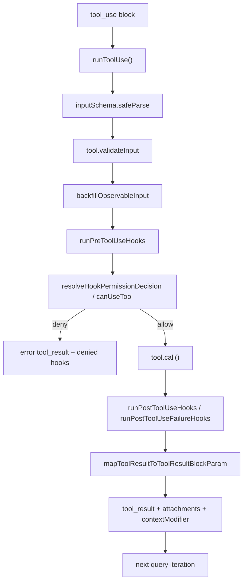

图示说明：

- 这张图强调 `tool.call()` 只是协议中段，不是整个执行链。
- pre-hook、permission、post-hook 与 result mapping 都可能改变最终进入 transcript 的结果。

文件映射：

- 协议定义：`src/Tool.ts`
- 工具池装配：`src/tools.ts`
- 调度：`src/services/tools/toolOrchestration.ts`、`src/services/tools/StreamingToolExecutor.ts`
- 执行：`src/services/tools/toolExecution.ts`
- hook：`src/services/tools/toolHooks.ts`

关键观察：

- 已确认事实：ClaudeCode 的 planner/executor separation 是隐式的。主模型负责发出 `tool_use`，运行时负责保证这些 `tool_use` 在安全和一致的协议内被执行。

### 10.3 Memory 记忆机制

#### 10.3.1 机制目标

这一层的核心问题不是“怎样保存更多历史”，而是如何在不同时间尺度上维护不同可信度的连续性：

- 当前 turn 需要的是低延迟 execution cache。
- 当前会话需要的是可恢复 transcript 和阶段性摘要。
- 跨会话需要的是 durable memory，但又不能把 repo 事实写成容易过期的第二真相。
- 子代理需要的是可共享 cache prefix 和局部独立状态，而不是复制整个 REPL 世界。

ClaudeCode 因此没有采用单一 memory substrate，而是分层建模。

#### 10.3.2 记忆层次与职责边界

当前可见代码至少有四类主要记忆层，以及一类辅助缓存层：

- `memdir`：跨会话 durable memory，文件化存储，强调“值得长期记住的事实、惯例、坑点”，位于 `src/memdir/*`。
- session memory：当前会话的 markdown 摘要，位于 `src/services/SessionMemory/*`。
- transcript：JSONL 形式的事实链与恢复基础，位于 `src/utils/sessionStorage.ts` / `src/utils/sessionRestore.ts`。
- agent memory：面向 AgentTool / subagent 的 user/project/local scope 记忆，位于 `src/tools/AgentTool/agentMemory.ts` 等。
- execution cache：`readFileState`、`contentReplacementState`、file-read cache 等，它们提供性能和去重，不应被误解为语义 memory。

边界原则同样在代码里写得很明确。`memoryTypes.ts` 明确限制 memory 不应保存代码结构、架构、git history、短期 task context 等可重新推导或快速过期的信息。也就是说，团队在刻意把“长期记忆”与“仓库现状”解耦。

#### 10.3.3 memdir 的检索与注入

`findRelevantMemories()` 展示了 durable memory 的检索路径：

1. `scanMemoryFiles(memoryDir, signal)` 扫描 memory 文件头部和描述信息，而不是读全文。
2. `formatMemoryManifest(memories)` 把候选 memory 组织成 manifest。
3. `sideQuery()` 用 Sonnet 结合 `SELECT_MEMORIES_SYSTEM_PROMPT` 选择最多 5 个文件名。
4. 返回的是 `path + mtimeMs`，这样调用方可以在不再次 stat 的情况下向主模型解释 freshness。

这条路径说明两个已确认事实：

- 仓库里当前没有展示 embedding / vector index / ANN 检索。
- memory retrieval 的策略是“先 cheap scan，再由小模型做 rerank/select”，而不是事先构建仓库知识图谱。

`attachments.ts` 里的 `startRelevantMemoryPrefetch()` 则揭示了它在主循环中的位置：

- 只在 auto memory 和对应 gate 打开时启动。
- 只拿最后一个真实用户消息作为 query，`isMeta` 消息不会触发它。
- 单词级的极短 prompt 会被跳过，避免每个“ok”“继续”都触发 memory 检索。
- 已经 surfacing 过的 memory 路径会被 `alreadySurfaced` 预算过滤。
- 它完全异步，不阻塞当前 `query()` 启动。

因此，memdir 更像“背景预取的候选知识片段”，而不是主 query 阻塞式依赖。

#### 10.3.4 session memory 的提取与更新

`sessionMemory.ts` 展示了当前会话摘要的完整生命周期。

触发条件来自 `shouldExtractMemory(messages)`：

- 首次初始化要求总上下文 token 数达到阈值，默认 `10000`，由 `sessionMemoryUtils.ts` 提供。
- 之后每次更新需要同时满足最小 token 增量阈值，默认 `5000`，以及工具调用阈值，默认 `3`，或者在“最近 assistant turn 没有 tool calls”的自然停顿点触发。
- 只有 `querySource === 'repl_main_thread'` 会跑 session memory，subagent、summary agent、其它 fork 都不会触发。

真正执行时：

1. `extractSessionMemory` 先检查 GrowthBook gate 与 autocompact 是否允许。
2. 它调用 `createSubagentContext(toolUseContext)` 创建隔离上下文，避免 setup 过程污染父 context 的 `readFileState`。
3. `setupSessionMemoryFile()` 会确保 memory 文件存在，如果刚创建还会载入模板。
4. 它在读文件前主动 `toolUseContext.readFileState.delete(memoryPath)`，防止 `FileReadTool` 因 dedup 返回 `file_unchanged` stub，而不是实际内容。
5. `buildSessionMemoryUpdatePrompt()` 生成更新提示词。
6. `runForkedAgent()` 在 `querySource: 'session_memory'` 下运行一个受限 subagent。
7. `createMemoryFileCanUseTool(memoryPath)` 把权限严格限制为只允许 `FileEditTool` 修改这个确切路径。

这个实现非常能说明 ClaudeCode 的 memory 设计哲学：session memory 不是由主线程“直接拼接摘要字符串”更新，而是通过受限 agent 在真实工具协议下修改一个 markdown 文件。这让它和其它工具流、prompt cache、transcript 机制保持一致。

#### 10.3.5 transcript、forked agent 与 continuity

当前仓库中的 continuity 核心不在 `messages[]`，而在 transcript 与 forked-agent 辅助结构。

`sessionStorage.ts` / `sessionRestore.ts` 的职责是：

- 把消息、compact boundary、task 状态、collapse 结果等持久化成 JSONL / 辅助状态。
- 在恢复时重新装配 file history、todos、collapse state、message 链，而不是简单地恢复一个字符串数组。

`CacheSafeParams` 则是 subagent continuity 的关键。它把以下 cache-critical 前缀固化下来：

- `systemPrompt`
- `userContext`
- `systemContext`
- `toolUseContext`
- `forkContextMessages`

这样 `runForkedAgent()` 在共享 prompt cache 的同时，又可以通过 `createSubagentContext()` 隔离可变状态。这个设计既避免了每个子代理都从零构造 prefix，也避免直接共享父线程的可变引用。

`sideQuery()` 则提供另一种轻量 continuity：对于 memory 选择、classifier、session search 这类小型决策，不需要完整 `query()` 主循环，只需一个带系统前缀的小模型调用即可。

#### 10.3.6 其它 memory-like 机制与边界

需要明确区分几类“看起来像 memory”的机制：

- `readFileState` 是 dedup / freshness cache，用于避免重复读取或重复 surfacing 相同文件，不是语义记忆。
- `contentReplacementState` 是 tool result budget 的持久化替换记录，用于恢复大结果而不占满窗口，也不是语义 memory。
- `lastSummarizedMessageId`、`tokensAtLastExtraction`、`extractionStartedAt` 等状态是 session memory scheduler 的控制变量，不是面向模型暴露的记忆内容。

这种区分很重要，因为它解释了为什么仓库中会同时存在多个“看起来在记东西”的模块，但它们的工程目的完全不同。

#### 10.3.7 错误处理、回退与取舍

memory 层的错误处理普遍偏保守：

- `findRelevantMemories()` 失败时只记录 debug warning 并返回空列表，不阻塞主 turn。
- `waitForSessionMemoryExtraction()` 采用 15 秒超时和 60 秒 stale threshold，避免后台摘要任务拖挂前台恢复路径。
- session memory 读写前主动隔离 `readFileState`，防止“缓存命中”掩盖真实文件内容。

这层的强项是职责分离清楚：durable memory、session summary、transcript recovery、execution cache 各自解决不同问题。弱点是整体理解成本较高，新工程师如果不显式区分这几层，很容易误以为系统里存在多个重复的 memory 子系统。

#### 图示：记忆层分工

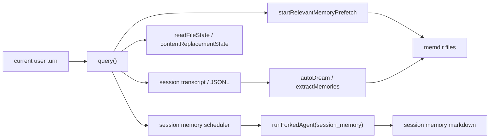

图示说明：

- 这张图强调 memory 是分层协作，而不是一个集中式数据库。
- `memdir` 更偏跨会话 durable memory；session memory 更偏当前会话摘要；transcript 则是事实链和恢复载体。

文件映射：

- durable memory：`src/memdir/findRelevantMemories.ts`
- session memory：`src/services/SessionMemory/sessionMemory.ts`、`src/services/SessionMemory/sessionMemoryUtils.ts`
- transcript continuity：`src/utils/sessionStorage.ts`、`src/utils/sessionRestore.ts`
- forked continuity：`src/utils/forkedAgent.ts`

关键观察：

- 已确认事实：仓库当前展示的 memory retrieval 不是 embedding-based，而是 scan + sideQuery rerank。

### 10.4 Dream 机制分析

#### 10.4.1 机制目标

`Dream` 的职责不是直接帮助当前 turn 回答问题，而是主动整理 memory substrate，提升未来会话的可恢复性和定向能力。它是这套系统里最接近“后台维护任务”的上下文工程机制。

从 `autoDream.ts` 的文件头注释可以直接确认：这是一套“Background memory consolidation”流程，会在时间门限和 session 数门限满足时，触发一个 forked subagent 去运行 `/dream` 风格的 consolidation prompt。

#### 10.4.2 触发结构与门控顺序

`initAutoDream()` 内部构造了闭包态 `runner`，并把 `lastSessionScanAt` 保存在闭包里，而不是模块级全局变量。注释明确说明这是为了让测试中的每次 `beforeEach` 都拿到新的闭包状态。

自动 Dream 的门控顺序是：

1. `isGateOpen()`：要求非 `Kairos`、非 remote mode、auto memory 已开启、`isAutoDreamEnabled()` 返回 true。
2. `readLastConsolidatedAt()`：用 lock 文件 mtime 表示上次 consolidation 时间。
3. 时间门限：默认 `minHours = 24`。
4. scan throttle：10 分钟内不会重复扫 session，即使时间门限已经通过。
5. `listSessionsTouchedSince(lastAt)`：统计上次 consolidation 之后被 touch 的 transcript session。
6. 当前 session 会被排除，避免“因为当前会话刚写过 transcript 就总能触发 dream”。
7. session 数门限：默认 `minSessions = 5`。
8. `tryAcquireConsolidationLock()`：只有拿到锁才真正启动 dream。

这个门控次序是有明显成本意识的：先跑 cheapest gate，再跑目录扫描，最后才竞争锁和启动 agent。

#### 10.4.3 锁、时间戳与失败恢复

`consolidationLock.ts` 的实现很有代表性：

- lock 文件名固定为 `.consolidate-lock`，放在 auto memory 根目录里，因此天然按项目根分区。
- 这个文件的 `mtime` 本身就是 `lastConsolidatedAt`。也就是说，Dream 同时把“互斥锁”和“上次成功/尝试 consolidation 的时间戳”编码进同一个文件。
- 文件内容是 PID，用于判断持有者是否仍存活。
- `HOLDER_STALE_MS = 1 hour`，即使 PID 还活着，mtime 太旧也会视作可回收，防止 PID 重用造成永久锁死。
- `tryAcquireConsolidationLock()` 会写入 PID 后再次读回校验，防止两个 reclaiming 进程同时竞争时都误以为自己赢得锁。
- `rollbackConsolidationLock(priorMtime)` 会在失败时把 mtime 回滚到之前的值，或者在 `priorMtime === 0` 时直接删除文件。

这套实现说明 Dream 不是“best effort fire and forget”那么简单，它明确处理了 crash、并发实例、锁竞争和失败重试节奏。

#### 10.4.4 Dream 子代理的执行路径

真正运行 Dream 时，`autoDream.ts` 会：

1. 通过 `registerDreamTask()` 把任务注册进 UI task registry。
2. 构造 `memoryRoot` 和 `transcriptDir`。
3. 使用 `buildConsolidationPrompt(memoryRoot, transcriptDir, extra)` 生成四阶段提示词。
4. 调用 `runForkedAgent()`，关键参数包括：
   - `querySource: 'auto_dream'`
   - `forkLabel: 'auto_dream'`
   - `skipTranscript: true`
   - `canUseTool: createAutoMemCanUseTool(memoryRoot)`
   - `onMessage: makeDreamProgressWatcher(...)`
5. 若成功，则 `completeDreamTask()`，并视 `filesTouched` 情况生成 `createMemorySavedMessage(...)`。
6. 若失败，则 `failDreamTask()` 并回滚 lock mtime。

`buildConsolidationPrompt()` 自身也很说明问题。它要求 dream agent 按四个阶段工作：

- Orient：先看 memory 目录和 index。
- Gather：优先看 daily logs、漂移 memory、必要时才窄 grep transcript。
- Consolidate：将新信息合并进 topic files，而不是大量新建重复文件。
- Prune and index：更新入口索引，把它保持在长度和体积限制内。

这不是开放式“想想看该怎么整理记忆”，而是非常强约束的维护型提示词。

#### 10.4.5 权限模型与 UI 映射

Dream 的权限模型是它最关键的安全边界之一。

注释和代码共同说明：

- Bash 被限制为 read-only 风格命令，提示词里甚至明确告诉 dream agent 不要探测写命令。
- `createAutoMemCanUseTool(memoryRoot)` 将可写范围限制在 auto-memory 目录内。
- transcript 与 memory 目录可以读，但对其它仓库状态不应产生副作用。

Dream 的 UI 映射则通过 `DreamTask.ts` 实现：

- task type 为 `dream`。
- `phase` 只有 `starting | updating` 两个值，且 phase 判断并不解析 prompt 的四个阶段，而是在第一次观察到 Edit/Write 的 `tool_use` 时从 `starting` 翻到 `updating`。
- `filesTouched` 只是通过 `makeDreamProgressWatcher()` 在 assistant `tool_use` block 中模式匹配 `FILE_EDIT_TOOL_NAME` / `FILE_WRITE_TOOL_NAME` 的 `file_path` 收集而来。
- 代码注释明确承认：`filesTouched` 是不完整反射，无法捕获 bash 间接写入。

因此 DreamTask 更像“给后台 consolidation 一个可观测 UI 外壳”，而不是 Dream 的真实状态机。

#### 10.4.6 已确认事实、推断与未决点

已确认事实：

- autoDream 是真实存在且已接入后台 housekeeping 的机制。
- 它通过 forked agent 在后台运行，而不是主 query 的一个 mode。
- 它使用专门的锁文件、时间门限、session 门限和 UI task 映射。

合理推断：

- `consolidationPrompt.ts` 和注释反复把 Dream 描述成 `/dream` 风格工作流，因此手动 dream 很可能在其它 feature-gated 命令层中存在。

未决点：

- `recordConsolidation()` 在当前快照中只有定义，没有可见调用点。
- 注释提到 manual `/dream`，但在当前可见命令树中没有闭合调用链，因此不能把“手动 `/dream` 可用”当成已确认事实。

#### 10.4.7 工程取舍

Dream 的强项在于它把“长期记忆整理”从主交互路径中剥离出来，因此不会把 consolidation 成本压到当前用户 turn 上。它还复用了现有 forked agent、tool permissions、task UI、prompt cache 基础设施，避免另起一套后台框架。

弱点也很明确：

- 触发依赖时间和 session 数门限，反馈周期较长。
- 通过 UI 收集的 `filesTouched` 只是近似值，调试 Dream 修改了什么并不完全透明。
- 锁文件既承载互斥又承载时间戳，虽然工程上简洁，但语义复用较强，读代码时需要额外注意。

#### 图示：Dream 的后台 consolidation 流程

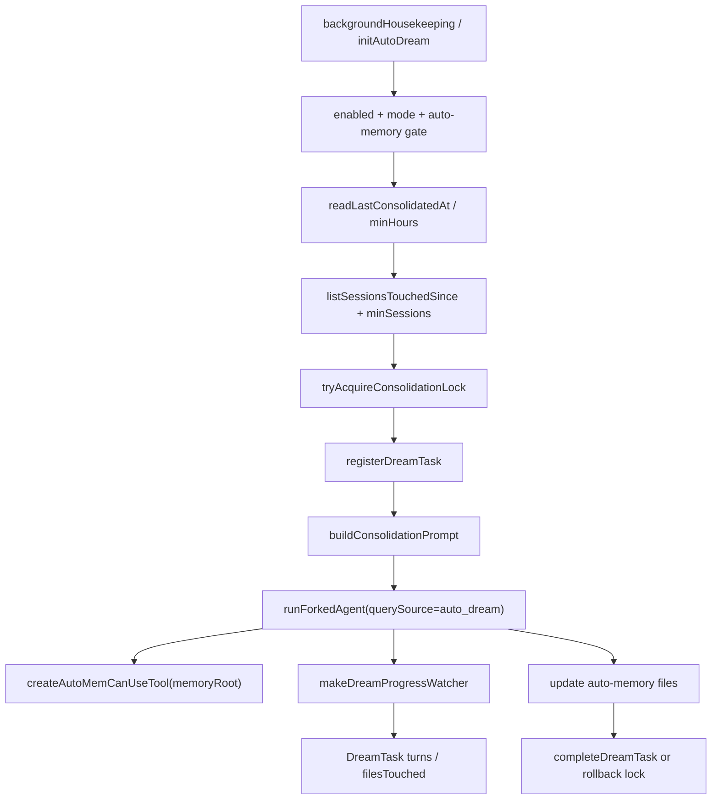

图示说明：

- 这张图强调 Dream 是后台 housekeeping 流程，而非主交互回合的一部分。
- `consolidationLock` 和 `DreamTask` 分别承担“并发控制”和“用户可见性”，二者都不等于 Dream 的实际记忆整理逻辑。

文件映射：

- 触发：`src/utils/backgroundHousekeeping.ts`
- 自动 Dream 主逻辑：`src/services/autoDream/autoDream.ts`
- 配置：`src/services/autoDream/config.ts`
- 锁：`src/services/autoDream/consolidationLock.ts`
- 提示词：`src/services/autoDream/consolidationPrompt.ts`
- UI task：`src/tasks/DreamTask/DreamTask.ts`

关键观察：

- 已确认事实：Dream 的真正角色是后台 memory gardener，而不是提高单次推理能力的特殊 mode。

### 10.5 技术总结与架构启示

#### 10.5.1 这些机制在整体交互架构中的位置

把以上机制放回整套系统，可以得到一个更准确的架构理解：

- 预处理层负责把用户输入编译成可执行 turn。
- `query()` 负责把 turn 压缩到可发送、可缓存、可持续的窗口形态。
- 工具协议层负责让模型发出的 `tool_use` 变成可执行、可审计、可恢复的外部动作。
- memory 层负责把不同时间尺度上的连续性拆开治理。
- Dream 负责把“未来会话需要的 durable memory”从主交互成本中剥离出去。

因此，ClaudeCode 的 context engineering 并不是某个 retrieval 算法或某个 prompt 模板，而是一整套围绕交互生命周期构建的运行时。

#### 10.5.2 架构优势

- 强缓存意识：`fetchSystemPromptParts()`、`getUserContext()`、`getSystemContext()`、`CacheSafeParams` 都在尽力稳定前缀，最大化 prompt cache。
- 强协议意识：工具执行不是 ad hoc 调用，而是统一经过 schema、hook、permission、mapping、telemetry。
- 强分层意识：durable memory、session summary、transcript、execution cache 分工明确。
- 强后台治理意识：Dream 和 session memory 说明系统并不把所有上下文维护都压到当前 turn。

#### 10.5.3 复杂度热点与技术债

- `query.ts` 是最明显的复杂度中心。它同时承担消息窗口治理、compact、collapse、tool loop、model fallback、memory/skill 预取等职责，修改风险高。
- `ToolUseContext` 职责极重，是跨模块粘合剂。它让扩展变得方便，但也让依赖方向不再清晰，许多模块都通过它间接读写全局状态。
- feature gate 广泛分布于预处理、tool exposure、compact、memory 和 Dream，导致某些调用链只有在特定构建或配置下才完整可见。
- memory 层虽然分工清楚，但新工程师很容易把 session memory、durable memory、transcript 和 cache 混为一谈，学习曲线较陡。

#### 10.5.4 面向工程师的最终判断

基于当前可见代码，一个更准确的概括是：

- 已确认事实：ClaudeCode 在“项目理解与上下文工程”上更像一个 runtime context operating system，而不是单纯“把 LLM 接到 terminal”的应用。
- 已确认事实：它的关键能力不在于离线构建完整 repo graph，而在于在线地装配上下文、在线地执行工具、在线地治理窗口，并在后台持续整理记忆。
- 合理推断：这套设计特别适合开放式、长时、终端驱动的工程工作流，因为它允许系统边运行边补充上下文，而不需要在起步时完成全仓建模。

它的核心 trade-off 也因此非常鲜明：获得了高灵活性和强 runtime 控制，但代价是主循环和上下文治理逻辑变得厚重，理解和安全修改的门槛明显提高。

---

## 11. 新工程师学习路线

### 阶段一：先抓运行边界

阅读顺序：

1. `src/main.tsx`
2. `src/setup.ts`
3. `src/entrypoints/init.ts`
4. `src/replLauncher.tsx`
5. `src/interactiveHelpers.tsx`

要回答的问题：

- 进程从哪里进入？
- trust / settings / terminal / cwd 是在哪一层准备好的？
- REPL 是如何真正被渲染起来的？

### 阶段二：再抓执行内核

阅读顺序：

1. `src/query.ts`
2. `src/services/api/claude.ts`
3. `src/QueryEngine.ts`
4. `src/utils/handlePromptSubmit.ts`
5. `src/screens/REPL.tsx` 中 query 调用附近

要回答的问题：

- REPL 和 SDK 各自如何进入 `query()`？
- `query()` 的阶段顺序是什么？
- transcript 和 resume 为什么在 headless 路径有额外逻辑？

### 阶段三：理解工具与权限

阅读顺序：

1. `src/Tool.ts`
2. `src/tools.ts`
3. `src/services/tools/toolExecution.ts`
4. `src/services/tools/toolOrchestration.ts`
5. `src/services/tools/StreamingToolExecutor.ts`
6. `src/hooks/useCanUseTool.tsx`
7. `src/utils/permissions/permissions.ts`

要回答的问题：

- 工具抽象为什么需要 `buildTool(...)`？
- 并发安全是怎么被治理的？
- 权限为什么不是某个单一函数，而是一整套异步决策链？

### 阶段四：理解状态与集成壳

阅读顺序：

1. `src/state/AppStateStore.ts`
2. `src/state/AppState.tsx`
3. `src/screens/REPL.tsx`

要回答的问题：

- `AppState` 为什么这么重？
- 哪些状态是 UI 状态，哪些其实是运行态？
- REPL 为什么是复杂度热点？

### 阶段五：理解扩展与 agent

阅读顺序：

1. `src/services/mcp/config.ts`
2. `src/services/mcp/client.ts`
3. `src/utils/plugins/pluginLoader.ts`
4. `src/utils/plugins/loadPluginCommands.ts`
5. `src/skills/loadSkillsDir.ts`
6. `src/tools/AgentTool/AgentTool.tsx`
7. `src/tools/AgentTool/runAgent.ts`
8. `src/tasks/*`

要回答的问题：

- 插件、MCP、skills 的职责边界是什么？
- agent 生命周期如何插入 hooks、skills、MCP、transcript 和 cleanup？
- 后台任务为什么能和主会话统一视图？

---

## 12. 术语表

### REPL

终端交互壳。不是简单文本输入视图，而是主运行态协调层。

### QueryEngine

SDK/headless 会话 façade，负责把输入、transcript、permission denial、replay 逻辑包装后交给 `query()`。

### `query()`

真正共享的执行内核。REPL 与 SDK/headless 都会进入它。

### ToolUseContext

工具层访问应用能力的主要协议对象。

### AppState

统一运行态容器，不只是 UI 状态。

### Skill

基于 markdown/frontmatter 的 prompt command，偏流程知识复用。

### Plugin

偏分发和命令/skill 打包的扩展单位。

### MCP

偏协议化外部能力接入的扩展体系。

---

## 13. 附录：优先阅读文件索引

### 入口与生命周期

- `src/main.tsx`
- `src/setup.ts`
- `src/entrypoints/init.ts`
- `src/replLauncher.tsx`
- `src/interactiveHelpers.tsx`

### 查询执行

- `src/query.ts`
- `src/services/api/claude.ts`
- `src/QueryEngine.ts`
- `src/utils/handlePromptSubmit.ts`
- `src/screens/REPL.tsx`

### 工具与权限

- `src/Tool.ts`
- `src/tools.ts`
- `src/services/tools/toolExecution.ts`
- `src/services/tools/toolOrchestration.ts`
- `src/services/tools/StreamingToolExecutor.ts`
- `src/hooks/useCanUseTool.tsx`
- `src/utils/permissions/permissions.ts`

### 扩展与任务

- `src/services/mcp/config.ts`
- `src/services/mcp/client.ts`
- `src/utils/plugins/pluginLoader.ts`
- `src/utils/plugins/loadPluginCommands.ts`
- `src/skills/loadSkillsDir.ts`
- `src/tools/AgentTool/AgentTool.tsx`
- `src/tools/AgentTool/runAgent.ts`
- `src/Task.ts`
- `src/tasks/LocalShellTask/LocalShellTask.tsx`

---

## 14. 总结

从可见源码看，这套系统最突出的特点不是“用了 AI”，而是它已经把 AI agent 产品化过程中最难的几块都落成了代码：

- 启动与运行模式分流
- 共享 query 内核
- 工具执行协议化
- 权限治理系统化
- 扩展机制分层化
- 长会话恢复与上下文治理

它最大的挑战也来自同一个事实：这些能力几乎都堆叠在同一套终端运行时里。于是：

- `query.ts` 成为上下文治理中心
- REPL 成为集成壳
- `AppState` / `ToolUseContext` 成为耦合枢纽
- feature gate 把行为矩阵越撑越大

如果要长期维护这套系统，真正关键的不是背目录，而是抓住四个支点：

1. `query()` 是共享执行内核
2. REPL 与 SDK/headless 是不同入口壳
3. 工具执行和权限系统是跨层治理核心
4. 插件、MCP、skills 是三条不同扩展轴

只要把这四点建立成心智模型，后续阅读其它模块时就不会迷失在海量文件与 feature gate 中。
